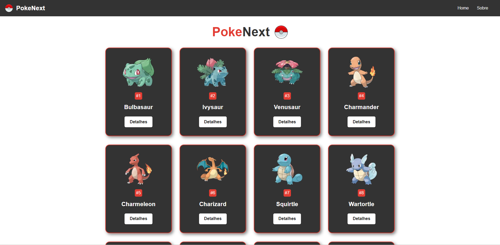
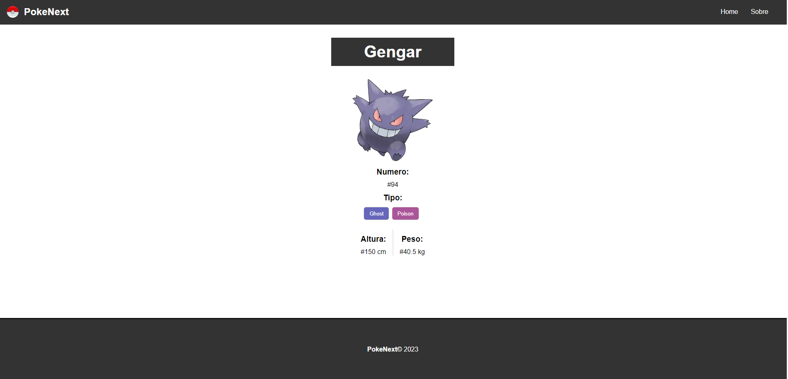

# PokeNext 

## 📖 Introdução 

A PokeNext é uma aplicação web que contém as principais informações dos primeiros 251 pokemons, como: nome, tipo, movimentos, entre outros, utilizando a API [PokeApi](https://pokeapi.co/).
Este projeto foi construido com base nas aulas de Matheus Battisti para estudo em desenvolvimento de aplicações web utilizando NextJs.

## 🔗Link de Acesso
- Deploy Vercel: [Clique aqui!](https://pokenext-danielemidio1988.vercel.app/)

## 👥Equipe
| [<br><sub>Daniel Emidio</sub>](https://github.com/DanielEmidio1988) |
| :---: |

## 🧭Status do Projeto
- ⏳Concluído

## 📄Concepção do Projeto

### Instalando
```bash
# Instalando dependências
npm install

# executando o projeto
npm run dev
```

### Layout

| <br><sub>Home Page</sub> | <br><sub>Detalhes</sub> |
| :---: | :---: |


### Funcionalidades
```bash
- Listagem de Pokemons
- Detalhes do Pokemon
```

## 💡Programas utilizados:
- VSCode

## 💻Tecnologias 


## 📫 Contato

E-mail: emidio.daniel@hotmail.com

[](https://www.linkedin.com/in/danielemidio1988/)
[](https://www.codewars.com/users/DanielEmidio1988)
